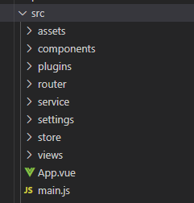

# BabyCrud - Vue

## Resumo
Primeiramente gostaria da sua apinião e sugestão sobre o código e estrutura, ficaria muito grato por compartilhar de seu conhecimento.  
A aplicação foi desenvolvida com o [Vuetify](https://vuetifyjs.com/en/) que é um framework responsivo em [Vue.js](https://vuejs.org/) e baseado no Material Design, como padrão de gerenciamento de estado utilizei o [Vuex](https://vuex.vuejs.org/ptbr/).

 Como o intuito é enfatisar o FRONT-END, a aplicação roda com o back-end [json-server](https://github.com/typicode/json-server).

 ## Estrutura de diretórios
 
  

Estrutura contida dentro da pasta src.  

